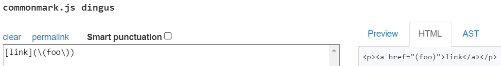
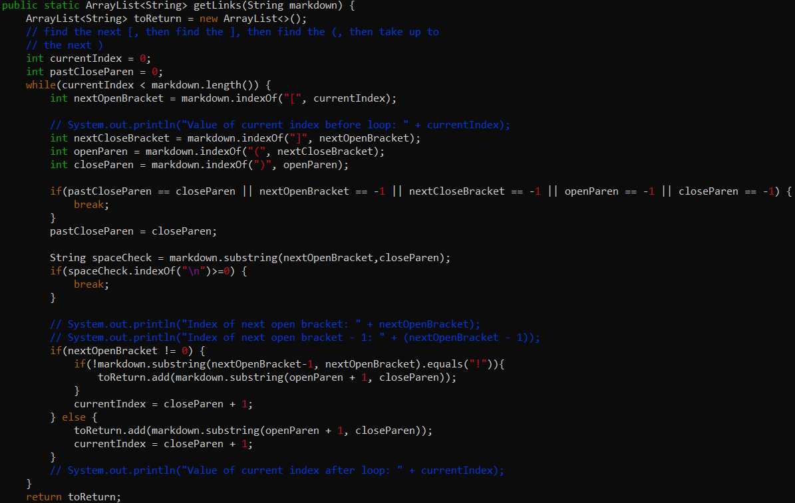

# Lab Report #5 Week 10

## Chosen Test #1: 494.md

### Test File #494 Code:
```
[link](\(foo\))
```

**Expected Output (CommonMark):**



```
My output: [\(foo\]
Provided implentation output: [\(foo\)]
```

### Which implementation is correct?
* Neither implementations are correct because the expected link outcome, according to the html on the CommonMark demo website, is supposed to be just [(foo)], but both tested implementations have backslashes in the output.

### Describe the bug and what code should be fixed?
* For my implementation, the bug present is that the backslashes should not be present in the link output, and they should instead make the parenthesis that come after them be able to be included in the link instead of ending the link early (nested parenthesis with only parenthesis present and no backslashes in link).

**My Implementation (Missing Check for Backslash "\"):**



## Test #2

Line 1040 (Test File #567)
```
[not a link]
[]
```

1) How you found the tests with different results (Did you use diff on the results of running a bash for loop? Did you search through manually? Did you use some other programmatic idea?)

* I used `diff` in order to compare two .txt files that contain the results of running the bash for loop for both my implementation of markdown parse and also the provided implementation. After, I noted which lines had differences and I looked though results.txt in my implementation directory. Since I used `echo` to print out the name of test files, I just had to find the test file name of whichever line had the differences.