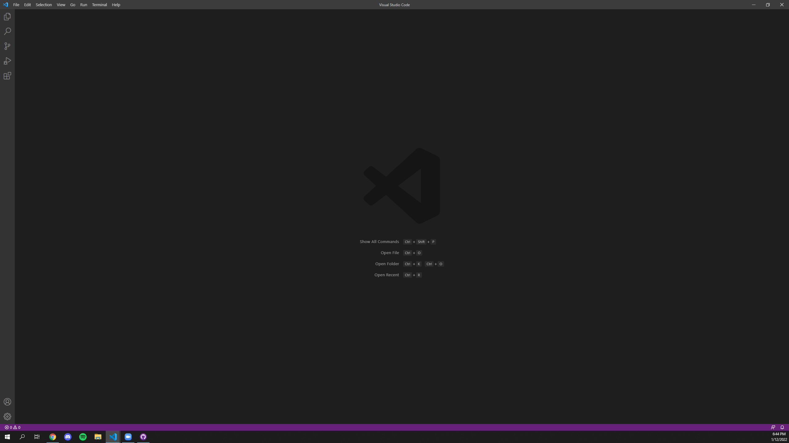

# Week 2 Lab Report
## Introduction
* This lab report is a tutorial on how to log into a course-specific account on UCSD's `ieng6`. 
* Through using a terminal, you can remotely access the CSE lab computers at UCSD and run commands to compile, run, and edit files and folders.
## Table of Contents
1. Installing VScode
2. Remotely Connecting
3. Trying Some Commands
4. Moving Files with `scp`
5. Setting an SSH Key
6. Optimizing Remote Running
## 1. Installing VScode
