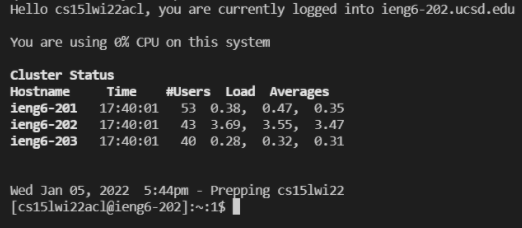
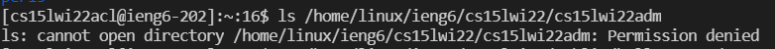

# Week 2 Lab Report
## Introduction

* This lab report is a tutorial on how to log into a course-specific account on UCSD's `ieng6`. 
* Through using a terminal, you can remotely access the CSE lab computers at UCSD and run commands to compile, run, and edit files and folders.

## Table of Contents

1. [Installing VScode](#1-Installing-VScode)
2. [Remotely Connecting](#2-Remotely-Connecting)
3. [Trying Some Commands](#3-Trying-Some-Commands)
4. [Moving Files with `scp`](#4-Moving-Files-with-`scp`)
5. Setting an SSH Key
6. Optimizing Remote Running

## 1. Installing VScode

* First, we are going to download and install [Visual Studio Code](https://code.visualstudio.com/) to access our files, folders, and terminal through it.
* After installing, when you open up VSCode, you should see a screen similar to below.


## 2. Remotely Connecting 

* If you are on Windows, you will first need to install a program called 
[OpenSSH](https://docs.microsoft.com/en-us/windows-server/administration/openssh/openssh_install_firstuse) 
to be able to connect to other computers with OpenSSH.
* You will then have to find your personal course-specific account for CSE15L through
[Account Lookup](https://sdacs.ucsd.edu/~icc/index.php)
* You will then open a terminal in VSCode(Ctrl/Command + `) and input 
```
$ ssh cs15lwi22acl@ieng6.ucsd.edu
```
* (It is one, five, l(not one))
* Once you press enter, since it is the first time you are connected to this server, you will receive this message:
```
⤇ ssh cs15lwi22acl@ieng6.ucsd.edu
The authenticity of host 'ieng6.ucsd.edu (128.54.70.227)' can't be established.
RSA key fingerprint is SHA256:ksruYwhnYH+sySHnHAtLUHngrPEyZTDl/1x99wUQcec.
Are you sure you want to continue connecting (yes/no/[fingerprint])? 
```
* This message is expected when connecting to a new server for the first time,so just type yes and press enter.
* It will then ask you for your password, which you will type in and and press enter, and you will see a message like this in your terminal:<br>  

* If you see a similar message, that means you have successfully logged in.

## 3. Trying Some Commands

* Once you are logged in, now it is time to run some commands such as `cd`, `ls`, `pwd`, `mkdir`, and `cp`, both on the remote computer through `ssh` and on your personal computer.
* More useful commands you can try are: 
1. `cd ~`
2. `ls -lat`
3. `ls -a`
4. `ls <directory>` where your `<directory>` is `/home/linux/ieng6/cs15lwi22abc` and `abc` is another person's username
5. `cp /home/linux/ieng6/cs15lwi22/public/hello.txt ~/`
6. `cat /home/linux/ieng6/cs15lwi22/public/hello.txt`
* As seen below, you may not have permission to access certain directories or files using above commands

* To log out of the remote server, you can use either Ctrl + D, or run the `exit` command.

## 4. Moving Files with `scp`

