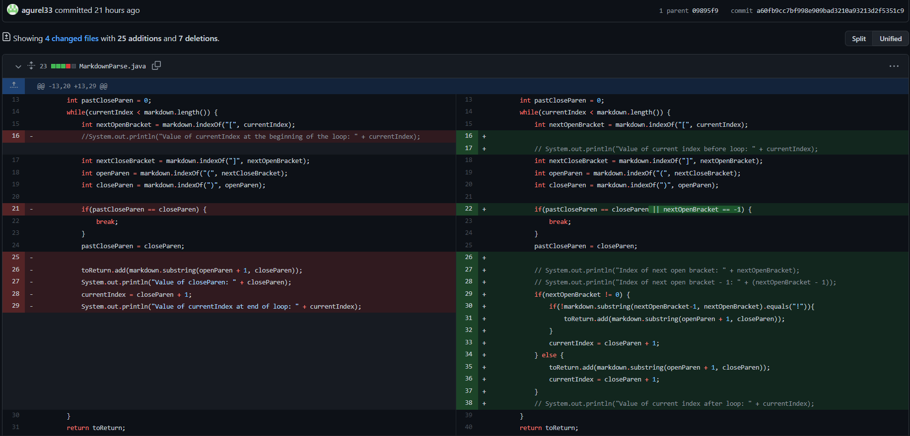
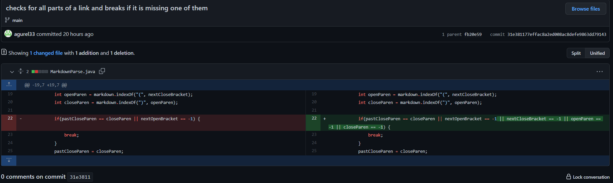

# Week 4 Lab Report

## Introduction

For this lab, given a very buggy template of MarkdownParse, we were supposed to run tests and figure out these bugs through creating text files that act as failure-inducing inputs. By using these failure-inducing inputs, we ran into symptoms that let us know of the bugs present in the code. Through repeated testing with failure-inducing inputs, we can find different symptoms present in the ouput and use these to address the bugs hiding in our code.

## Table of Contents

1. Code Change #1: Allowing for text after the links
2. Code Change #2: Not including images in the output
3. Code Change #3: Allowing for no links in a file

## Code Change #1: Allowing for text after the links


[Failure-Inducing Input](https://raw.githubusercontent.com/agurel33/markdown-parse/main/test-file2.md)

Output of Failure-Inducing Input before fixing the bug:
```
$ javac MarkdownParse.java
$ java MarkdownParse text-file2.md
Value of currentIndex at the beginning of the loop: 0
Value of currentIndex at end of loop: 28
Value of currentIndex at the beginning of the loop: 28
Value of currentIndex at end of loop: 28
Value of currentIndex at the beginning of the loop: 28
Value of currentIndex at end of loop: 28
Value of currentIndex at the beginning of the loop: 28
Value of currentIndex at end of loop: 28
Value of currentIndex at the beginning of the loop: 28
Value of currentIndex at end of loop: 28
Value of currentIndex at the beginning of the loop: 28
Value of currentIndex at end of loop: 28
Value of currentIndex at the beginning of the loop: 28
Value of currentIndex at end of loop: 28
... (infinite loop)
```

* Before this change, whenever a file didn't end with a link or had text after the last link, the code would run into an infinite loop. The bug would be that the getLinks() method would not accept strings that did not have links at the end of them. The failure-inducing input would be any input of a file that had some text or empty spaces after any given links in the file. The symptom of this failure-inducing input and bug is an infinite loop and no output given.

## Code Change #2: Not including images in the output



[Failure-Inducing Input](https://raw.githubusercontent.com/agurel33/markdown-parse/main/test-file4.md)

Output of Failure-Inducing Input before fixing the bug:
```
$ javac MarkdownParse.java
$ java MarkdownParse text-file4.md
[test.png, https://random.com, test2.png]
```

* Before this change, if the file had any images in it, the output would display those image locations/names as links. The bug would be that getLinks() would read the image format as a link and could not separate the two and would add those images to the links arraylist. The failure-inducing input would be any file that has an image in it, with the symptom of that failure-inducing input being that the image's would be printed out in the output.

## Code Change #3: Allowing for no links in a file



[Failure-Inducing Input](https://raw.githubusercontent.com/agurel33/markdown-parse/main/test-file5.md)

Output of Failure-Inducing Input before fixing the bug:
```
$ javac MarkdownParse.java        
$ java MarkdownParse test-file5.md
Exception in thread "main" java.lang.StringIndexOutOfBoundsException: begin 17, end -1, length 17
        at java.base/java.lang.String.checkBoundsBeginEnd(String.java:4601)
        at java.base/java.lang.String.substring(String.java:2704)
        at MarkdownParse.getLinks(MarkdownParse.java:35)
        at MarkdownParse.main(MarkdownParse.java:45)
```

* Before this change, if the file didn't have any links in it, the program would give an IndexOutOfBoundsException if there wasn't an open or close bracket or parenthesis in the text file. The bug is that the index of those missing elements is -1, and you cannot use that value of -1 in substring. The failure-inducing input is any file that doesn't have all the elements necessary for a link, with the symtom being that the output of using that input would result in an IndexOutOfBoundsException.