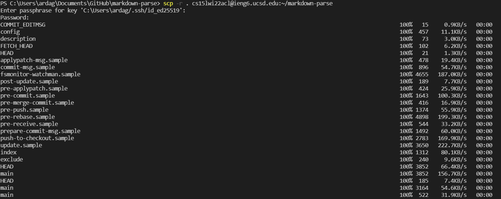
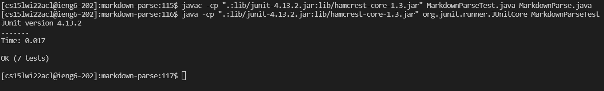
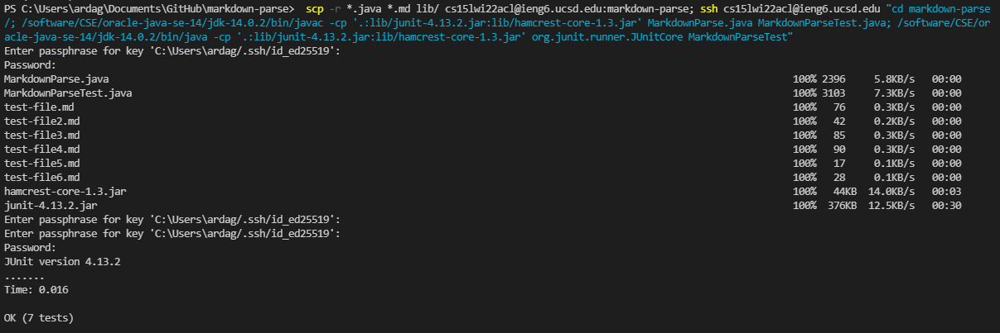

# Lab Report #3 Week 6

## Introduction

We can use `scp -r` to copy whole directories from our client onto the remote server. This process copies recursively, which means that we only need one command to copy over all of `markdown-parse` onto the server.

## Copy whole directories with `scp -r`

1. Set working directory to markdown-parse, which you can check using the command `pwd`. 

2. Using the following command, we can use `scp` with `-r` to work it recursively and use `.` to represent our source or current directory that we want to copy over (make sure to give a name to the directory that you want to copy it into).
```
$ scp -r . cs15lwi22@ieng6.ucsd.edu:~/markdown-parse
```

3. This copies over everything such as the .git files, so if you only want to copy over the java, markdown, and lib files, you can use the following command:
* `*.java` targets all files that end in the extension `.java`
* `*.md` targets all files that end in the extension `.md`
* `lib/` targets the lib folder that contains the junit jar files
```
$ scp -r *.java *.md lib/ cs15lwi22@ieng6.ucsd.edu:markdown-parse
```

## Copying `markdown-parse` directory onto ieng6 account using `scp -r`



## Logging into ieng6 account, compiling and running the tests in repository




## Combining `scp`, `;`, and `ssh` to copy directory and run tests in one line

```
 scp -r *.java *.md lib/ cs15lwi22acl@ieng6.ucsd.edu:markdown-parse; ssh cs15lwi22acl@ieng6.ucsd.edu "cd markdown-parse/; /software/CSE/oracle-java-se-14/jdk-14.0.2/bin/javac -cp '.:lib/junit-4.13.2.jar:lib/hamcrest-core-1.3.jar' MarkdownParse.java MarkdownParseTest.java; /software/CSE/oracle-java-se-14/jdk-14.0.2/bin/java -cp '.:lib/junit-4.13.2.jar:lib/hamcrest-core-1.3.jar' org.junit.runner.JUnitCore MarkdownParseTest"
```

* After using this command, I got the following output:


