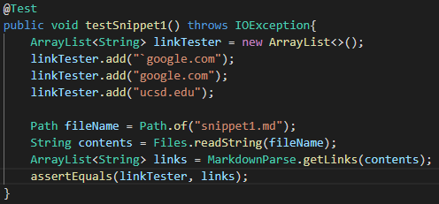

# Lab Report #4 Week 8

## Introduction
[My Repository](https://github.com/agurel33/markdown-parse)

[Reviewed Implementation](https://github.com/TheZenMasterz/markdown-parse)
## Snippet 1
```
`[a link`](url.com)

[another link](`google.com)`

[`cod[e`](google.com)

[`code]`](ucsd.edu)
```

When inputted into the method `getLinks()`, this code should be producing an `ArrayList<String>` with the links `[google.com, google.com, ucsd.edu]`.

### My Implementation



Correspounding output for passed test, or specific part of Junit that shows failure

### Reviewed Implementation

what should be produced, code for test in MarkdownParseTest.java, Correspounding output for passed test, or specific part of Junit that shows failure

## Snippet 2
```
[a [nested link](a.com)](b.com)

[a nested parenthesized url](a.com(()))

[some escaped \[ brackets \]](example.com)
```
### My Implementation

### Reviewed Implementation

## Snippet 3
```
[this title text is really long and takes up more than 
one line

and has some line breaks](
    https://www.twitter.com
)

[this title text is really long and takes up more than 
one line](
    https://ucsd-cse15l-w22.github.io/
)


[this link doesn't have a closing parenthesis](github.com

And there's still some more text after that.

[this link doesn't have a closing parenthesis for a while](https://cse.ucsd.edu/


)

And then there's more text
```
### My Implementation

### Reviewed Implementation

## Questions: 
* Do you think there is a small (<10 lines) code change that will make your program work for snippet 1 and all related cases that use inline code with backticks? If yes, describe the code change. If not, describe why it would be a more involved change.

**My Answer:**

* Do you think there is a small (<10 lines) code change that will make your program work for snippet 2 and all related cases that nest parentheses, brackets, and escaped brackets? If yes, describe the code change. If not, describe why it would be a more involved change.

**My Answer:**

* Do you think there is a small (<10 lines) code change that will make your program work for snippet 3 and all related cases that have newlines in brackets and parentheses? If yes, describe the code change. If not, describe why it would be a more involved change.

**My Answer:**