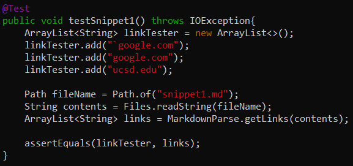
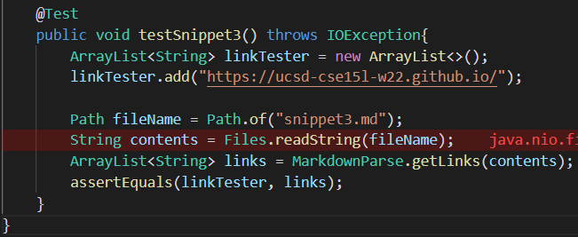
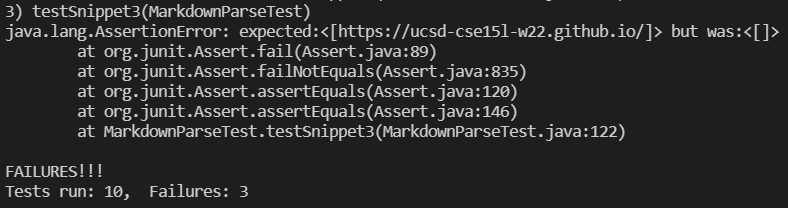
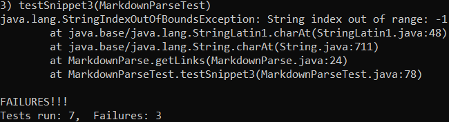

# Lab Report #4 Week 8

## Introduction
[My Repository](https://github.com/agurel33/markdown-parse)

[Reviewed Implementation](https://github.com/TheZenMasterz/markdown-parse)
## Snippet 1
```
`[a link`](url.com)

[another link](`google.com)`

[`cod[e`](google.com)

[`code]`](ucsd.edu)
```

When inputted into the method `getLinks()`, this code should be producing an `ArrayList<String>` with the links `[google.com, google.com, ucsd.edu]`.

### **My Implementation**

**Test:**


**Result: FAILED** 


### **Reviewed Implementation**

**Test:**



**Result: FAILED**


## Snippet 2
```
[a [nested link](a.com)](b.com)

[a nested parenthesized url](a.com(()))

[some escaped \[ brackets \]](example.com)
```

When inputted into the method `getLinks()`, this code should be producing an `ArrayList<String>` with the links `[a.com, a.com(()), example.com]`.

### **My Implementation**

**Test:**


**Result: FAILED**


### **Reviewed Implementation**

**Test:**


**Result: FAILED**


## Snippet 3
```
[this title text is really long and takes up more than 
one line

and has some line breaks](
    https://www.twitter.com
)

[this title text is really long and takes up more than 
one line](
    https://ucsd-cse15l-w22.github.io/
)


[this link doesn't have a closing parenthesis](github.com

And there's still some more text after that.

[this link doesn't have a closing parenthesis for a while](https://cse.ucsd.edu/


)

And then there's more text
```
### **My Implementation**

**Test:**



**Result: FAILED**




### **Reviewed Implementation**

**Test:**


**Result: FAILED**



## Questions: 
* Do you think there is a small (<10 lines) code change that will make your program work for snippet 1 and all related cases that use inline code with backticks? If yes, describe the code change. If not, describe why it would be a more involved change.

**My Answer:**
Yes, I think that I could make my program work for snippet 1 with a small code change. I just need to include a check using an if statement to find backticks for inline code using the method indexOf(), and check to see the placement of those backticks using nested if statements. If the first backtick is in front of the open bracket, then everything until the second backtick would be seen as inline code and thus not as a link, and we would have currentIndex jump to 1 + the index of the second backtick.

* Do you think there is a small (<10 lines) code change that will make your program work for snippet 2 and all related cases that nest parentheses, brackets, and escaped brackets? If yes, describe the code change. If not, describe why it would be a more involved change.

**My Answer:**
I think that I could make a small code change to make my program work and compatible with escaped brackets. However, I think I would need more than 10 lines, or make a big code change, to check for nested links, paranthesis, and brackets. After finding the initial pairing of open and close brackets or parentheses, there would have to be an if statement checking if there is another set of those elements within it, and if there is, save that inside to be a link, and skip until the end of the link.

* Do you think there is a small (<10 lines) code change that will make your program work for snippet 3 and all related cases that have newlines in brackets and parentheses? If yes, describe the code change. If not, describe why it would be a more involved change.

**My Answer:**
I don't think that I could make a small code change to allow my program to work for snippet 3 because the program would need to use more if statements in order to check the syntax and placement of the brackets and parentheses, and there are a lot of cases that this program would have to check for in order to not include the wrong links. Also, my line-break check (for `\n`) in my current code would have it that none of these links are actually valid because there are new lines in between the brackets and in between the parentheses, but however, my preview for snippet 3 shows that these are still valid links that should be included in the parse.
